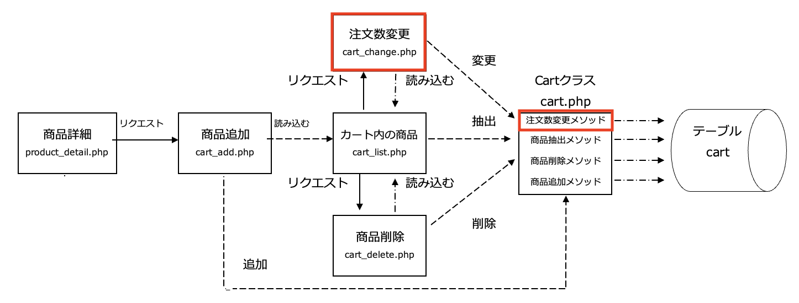
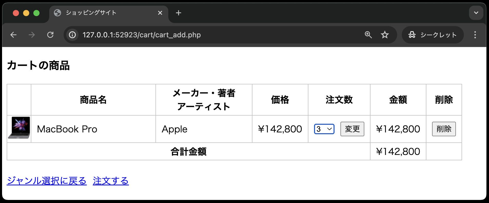
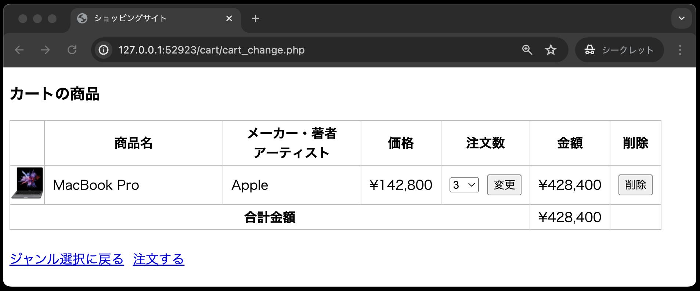

# 仕様書④ : カート内の商品の注文数を変更する

## カートの概要説明

カート内の商品画面(`cart_list.php`)には、以下の３つの機能が順番に追加されます。

- カート内に商品を追加する・・・仕様書③で実装する
- カート内の商品を表示する・・・仕様書③で実装する
- 特定の商品をカートから削除する・・・仕様書④で実装する
- カート内の商品の注文数を変更する・・・仕様書④で実装する ←本章はここ



## カート内の商品画面（cart_list.php）の修正

- 「変更」ボタンを追加し、クリックすると「注文数変更」(`cart_change.php`)に商品番号と変更後の注文数を送信する
  - 「変更」ボタンは、リンクではなく`<form>`タグの中に`<input type="submit>`で実装すること
- テーブル`cart`に登録されている注文数を最大値「10」までのプルダウンメニューを使用し、現在の注文数を表示する
  - 「仕様書② : 商品詳細画面」の商品詳細画面(`product_detail.php`)で作成したプルダウンメニューを参考にすると良いですが、**そのまま使うとうまく動かな**いので、修正が必要
    - そのままだと**現在の注文数が表示されない**ので修正が必要
    - プルダウンメニューには、初期表示で特定の値が選択されているようにする設定ができるので調べてみましょう！

## 注文数変更（cart_change.php）の作成

1. カート内の商品画面(`cart_list.php`)から送られてきた「商品番号」と「注文数」を受け取る
2. クラス`Cart`のオブジェクトを生成し、受け取った「商品番号」と「注文数」を引数に注文数変更メソッドを呼び出す
3. カート内の商品画面(`cart_list.php`)を読み込む

なお、注文数変更機能(`cart_change.php`)の作成については、「仕様書③ : カート内の商品画面、カート内の商品画面のバグ修正」の商品追加機能(`cart_add.php`)を参考にすると作りやすいです。

## クラスCart（cart.php）の修正

引数として受け取った「商品番号」をキーにテーブル`cart`の該当商品の「注文数」を変更する注文数変更メソッド(`changeQuantity`)を以下の仕様で定義します。

```text
アクセス修飾子： public
メソッド名： changeQuantity
引数： $ident（商品番号）、$quanity（注文数）
戻り値： なし
```

## ディレクトリ構成の確認

動作確認をする前に、ディレクトリ構成が以下のようになっていることを確認してください。

```text
public
├── cart
│   ├── cart_add.php
│   ├── cart_change.php ←本章で追加
│   ├── cart_delete.php
│   └── cart_list.php
├── classes
│   ├── cart.php
│   ├── dbdata.php
│   └── product.php
├── css
│   └── minishop.css
├── images
├── index.php
└── product
    ├── product_detail.php
    └── product_select.php
```

## 動作確認

1. 注文数「1」で商品がカートに入っている


2. この商品の注文数を「3」に変更する



3. 金額・合計金額が更新される。「変更」ボタンをクリックすると



## 課題の作成と提出

### 採点について

提出した課題はGitHub上で自動採点されます。
提出後、課題が合格しているかを確認してください。
合格していない場合は修正後pushし、再提出してください。

### 課題の合格基準

以下の3つを合格基準とします。

1. カートに同じ商品が追加でき、注文数が10を超える注文をしても、注文数は10になること
2. カート内の特定の商品が削除でき、すべての商品が削除された場合、その旨を表示すること
3. カート内の商品の注文数を変更できること

### 合格確認方法

1. 本課題の[課題ページ]()に再度アクセスします。
2. 画面上部にある`Actions`をクリックしてください。<br>

1. **一番上**の行に、緑色のチェックが入っていればOKです。<br>
